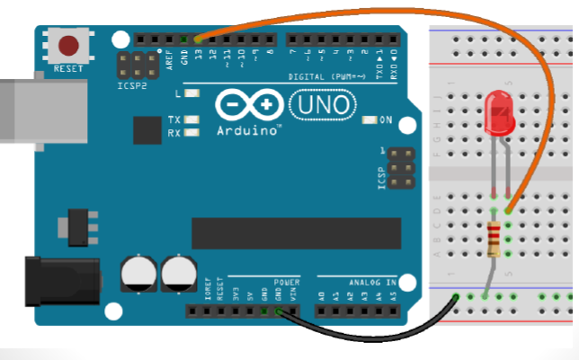
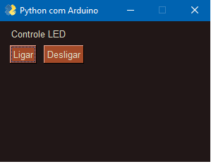

# Arduino_Python
# **Interface gráfica para Arduino em Python utilizando a biblioteca PySimpleGUI**
#para acionar saídas digitais logar e deslogar LEDs
 
![Badge em ]
 
 

 
 

 
 
## TECNOLOGIAS
- Python
- Arduino
 
**Silas Almeida**
 

   

